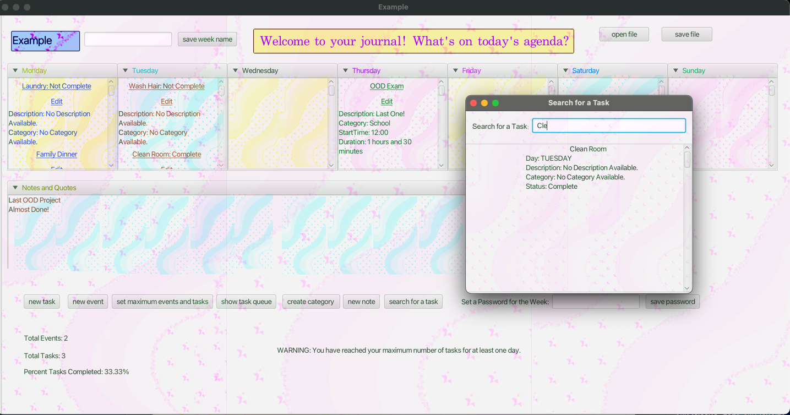

# 3500 PA05 Project Repo

[PA Write Up](https://markefontenot.notion.site/PA-05-8263d28a81a7473d8372c6579abd6481)

SOLID:

Single Responsibility Principle: We applied single responsibility by ensuring each class only served one main function 
in the program. For example, each Scene associated with a feature has its own controller and view (e.g., EditTaskView 
and EditTaskController). These controllers and views are instantiated based on user interaction in the main WeekView 
controlled by the main JavaJournalController. In the model, the Week class was the main model comprised of Task, 
Assignment, and Day classes. Any logic specifically involving one of these components was handled in the respective 
class. That component was updated within the week, as the week was composed of several of these smaller class 
components.

Open-Closed Principle: We used several abstract classes in this program, including AbstractAssignment. Both the Event 
and Task classes extended AbstractAssignment and protected fields. However, AbstractAssignment only contained methods 
and fields used by both assignments (e.g., name, day, category). For example, an Event includes start time and duration 
while Task does not. These fields were not placed in AbstractAssignment and only within Event. We followed this same 
practice for Tasks and their completion status. We also used an AbstractView for the load method; however, each class 
that extended AbstractView had its own constructor since each view loaded a different .fxml file. 
AbstractNewAssignmentController initializes .fxml fields and buttons for selecting categories and weekdays,
but what to do with those selections is determined by the subclasses.

Liskov-Substitution Principle: Our program also used an AbstractNewAssignmentController. This class was responsible 
for initializing fields used while creating an event and creating a task, such as toggling the Monday-Sunday buttons, 
as only one could be selected at a time. The class also initializes the categories in the choice box. 
EditTaskController, NewTaskController, and AbstractEventController all extend this class. AbstractEventController adds 
specifications for the text fields in start time and duration to only allow numerical input up to two digits. 
These abstract classes define no additional abstract methods that all other extending classes must implement. Since 
Task and Event have the same required fields in terms of what’s defined for the abstract classes, replacing the 
superclass would not break the system.

Interface Segregation Principle: Our program uses several interfaces that are kept short and sweet. Our controller 
interface only features the run() method, even though each controller contains several additional helper methods 
depending on the controller’s purpose. Because the controllers do not have much overlap in purpose, these methods are 
left out of the controller interface. When multiple classes used a method, Abstract Classes were implemented instead. 
Similarly, our view interface only contains the load() method used by all implementing classes. Our assignment 
interface also only contains methods applicable to the fields that a task and event share, such as day, description, 
name, and category. Methods associated with fields, such as start time, duration, and completion status, were only 
implemented in their relevant classes.

Dependency Inversion Principle: When handling the appearance of our Week View after creating or editing an assignment, 
the logic was handled in methods that used Assignment as a parameter instead of specifically Task or Event. They were 
then sent to respective methods to handle their class-specific data. This way, the weekly display depends on the 
interface Assignment instead of the specific implementation of the Task or Event. 

FUTURE EXTENSION:

Our program could be extended in several ways. For example, we allow assignment editing but not assignment deletion. 
Upon saving an edit, the old assignment is removed from the week and displayed, and a new one with the updated 
information is added. This could easily be implemented via a new button in the editor display that simply removes the 
VBox containing the assignment information from the display and updates the week with this data. Simply 
skipping the step of adding a new assignment. Another way our program could be extended is through a progress bar. 
Our program already tracks the percentage of completed tasks for a week, and this could easily be extended to calculate 
for days. The progress bar could also show completed tasks for a week. Each time the week’s statistics are updated in 
the program, functionality could simply be added to update the fill of the progress bar. 
